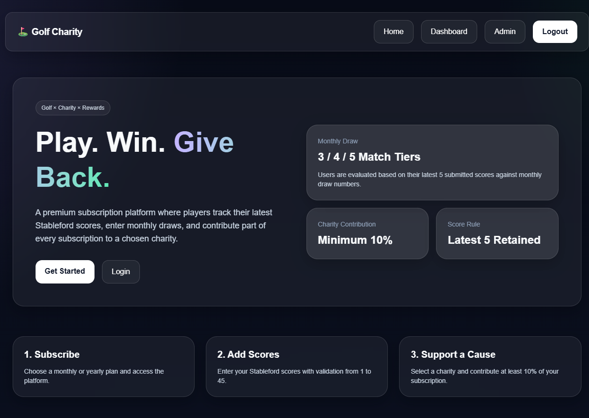
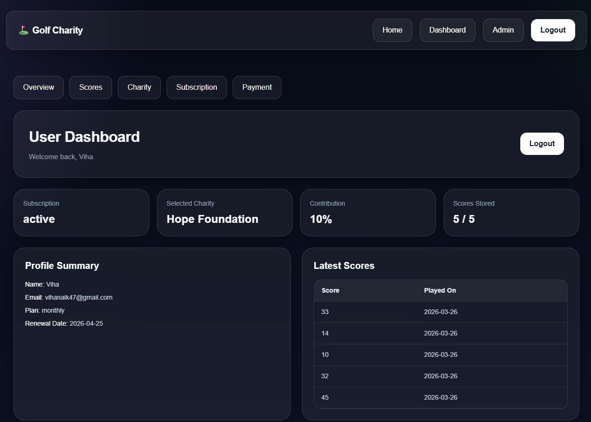
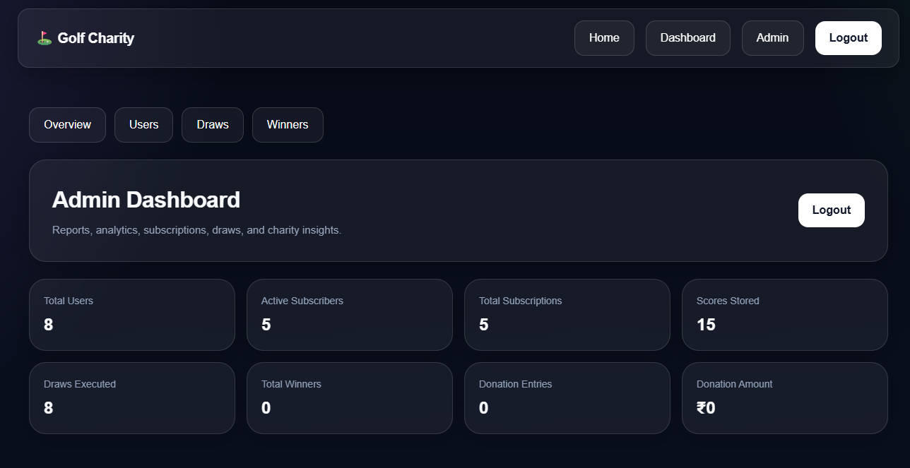
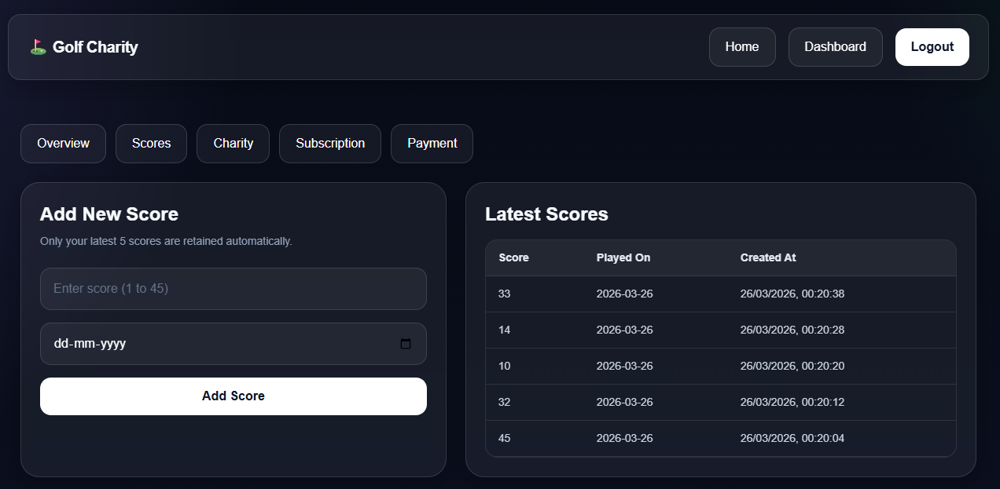
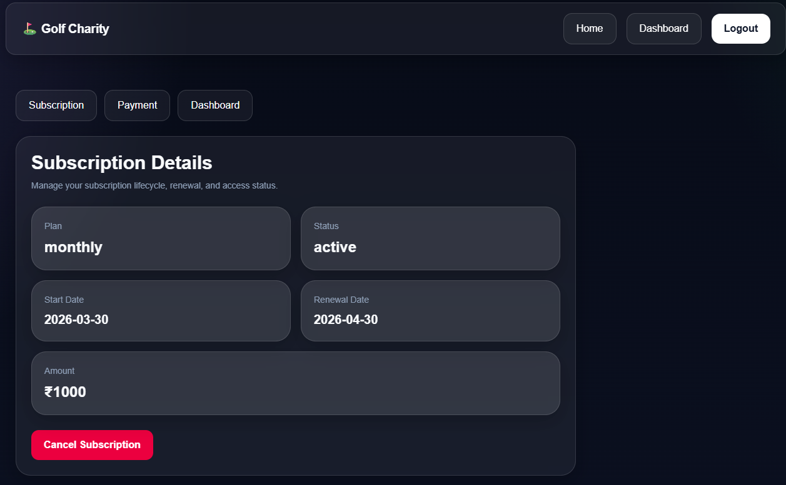
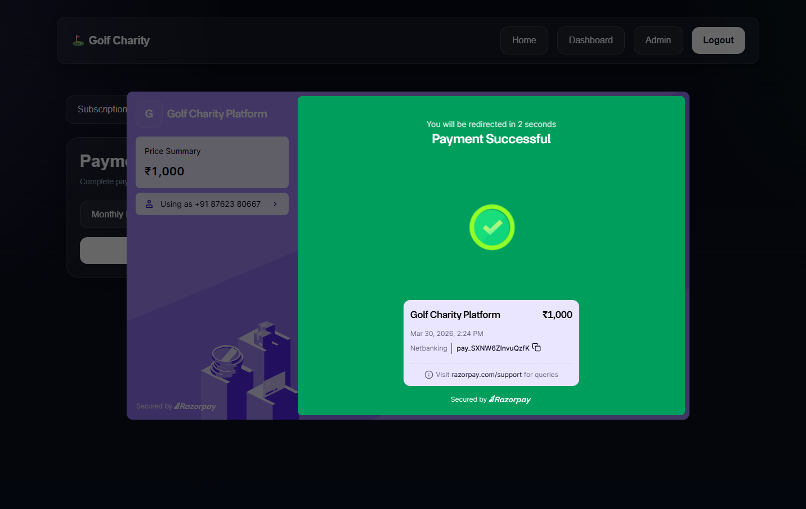

# ⛳ Golf Charity Subscription Platform

A full-stack subscription-based web application that combines **golf performance tracking**, **charity fundraising**, and a **monthly reward system**.

This project demonstrates real-world system design including authentication, payments, role-based access, and admin workflows.

---

## 🚀 Live Demo

* 🌐 Live Website: https://golf-web-platform.vercel.app
* 👤 User Dashboard: https://golf-web-platform.vercel.app/dashboard
* 🛠 Admin Panel: https://golf-web-platform.vercel.app/admin

---

## 💡 Why this project?

Most platforms focus either on sports tracking or donations.
This project combines both into a single system where:

* Users track golf performance
* Subscriptions contribute to charity
* Monthly draws reward participants

It demonstrates how **business logic, user engagement, and payments** can be integrated into one product.

---

## ✨ Key Features

* 🔐 User authentication (Supabase Auth)
* 👥 Role-based access (User / Admin)
* 💳 Subscription system with Razorpay
* 📊 Golf score tracking (Stableford format)
* 🧾 Score history with limit (last 5 scores)
* 🎯 Monthly draw system (reward-based)
* 🛠 Admin panel to manage users, draws, and charities
* 🚫 Access restriction for non-subscribed users
* 📱 Fully responsive UI

---

## 📸 Screenshots

### 🏠 Landing Page



### 📊 User Dashboard



### 🛠 Admin Dashboard



### 📈 Score Tracking



### 💳 Subscription Management



### 💰 Payment Integration



---

## 🏗 Architecture

The platform is built as a full-stack application using Next.js with integrated backend logic.

### Main Components

* **Frontend:** Next.js (App Router), TypeScript, Tailwind CSS
* **Backend Logic:** Next.js API routes
* **Authentication & Database:** Supabase
* **Payments:** Razorpay
* **Deployment:** Vercel

---

## 📂 Folder Structure

```bash
app/                  # Pages, routes, and API endpoints
components/layout/    # Navbar, sidebar, reusable UI
lib/                  # Utility functions and Supabase config
public/               # Static assets
middleware.ts         # Route protection and auth checks
```

---

## 🔄 Core Workflows

### 👤 User Flow

1. User signs up / logs in
2. Selects subscription plan
3. Completes payment via Razorpay
4. Gains access to dashboard
5. Enters golf scores
6. Participates in monthly draw

### 💳 Subscription Flow

* User selects plan
* Razorpay payment is triggered
* On success → subscription activated
* On expiry → access restricted

### 📊 Score Management

* Users can enter scores (range: 1–45)
* Only last 5 scores are stored
* New score removes oldest automatically

### 🛠 Admin Flow

* Manage users and subscriptions
* Create and manage draws
* Add/manage charities
* Publish winners

---

## ⚙️ Tech Stack

* **Frontend:** Next.js, TypeScript, Tailwind CSS
* **Backend:** Next.js API Routes
* **Database & Auth:** Supabase
* **Payments:** Razorpay
* **Deployment:** Vercel

---
## 🧠 Engineering Notes

- [Database Schema](./docs/schema.md)
- [RLS Policies](./docs/rls-policies.md)
- [Engineering Decisions](./docs/engineering-decisions.md)
- 
## 🧪 Setup Instructions

### 1. Clone the repository

```bash
git clone https://github.com/shrinidhinaik23/Golf-Web-Platform.git
cd Golf-Web-Platform
```

### 2. Install dependencies

```bash
npm install
```

### 3. Create `.env.local`

```env
NEXT_PUBLIC_SUPABASE_URL=your_url
NEXT_PUBLIC_SUPABASE_ANON_KEY=your_key
NEXT_PUBLIC_RAZORPAY_KEY_ID=your_key
RAZORPAY_KEY_SECRET=your_secret
```

### 4. Run the project

```bash
npm run dev
```

---

## ⚠️ Current Limitations

* Built as an MVP-style project
* Payment system is configured mainly for testing/demo
* Advanced analytics features are limited
* No automated testing or CI/CD yet

---

## 🚀 Future Improvements

* Add unit and integration testing
* Add CI/CD pipeline
* Improve admin analytics dashboard
* Add audit logs for admin actions
* Enhance subscription lifecycle handling
* Add notification system (email/SMS)

---

## 👨‍💻 Author

**Shrinidhi Naik**

* GitHub: https://github.com/shrinidhinaik23

---
